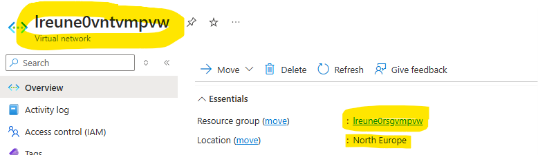
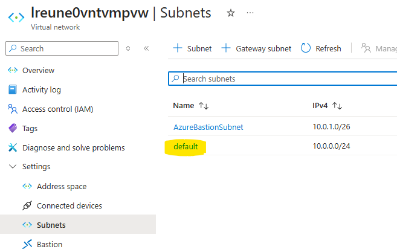

# Azure VM joined to an existing VNET

Before deploying the template you must have the following

2. **Virtual Network.** The virtual machines will join this VNET. If you don't have one, use this tutorial, see [Create virtual network](https://docs.microsoft.com/azure/virtual-network/virtual-networks-create-vnet-arm-pportal#create-a-virtual-network) to create one.

  

When you deploy this Azure Resource Template, you will create a logical selfhost IR in your Microsoft Purview and the following resources

- Azure Virtual Machine
- Network Interface
- Disk

The following pictures show you how to get required parameters:

